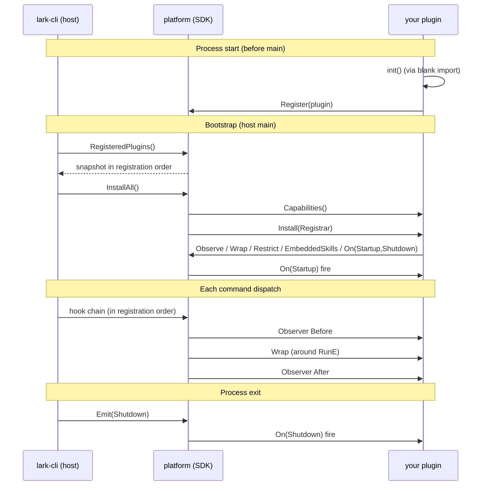

# lark-cli Plugin SDK

`extension/platform` is the **in-process plugin SDK** for lark-cli.
Plugins compile into a **fork** of the lark-cli binary via a blank
import; there is no `.so` loading, no RPC, no subprocess isolation.
A plugin shares the binary's address space and lifecycle.

## 5-minute hello world

```go
// myplugin/audit.go
package myplugin

import (
    "context"
    "log"

    "github.com/larksuite/cli/extension/platform"
)

func init() {
    platform.Register(
        platform.NewPlugin("audit", "0.1.0").
            Observer(platform.After, "log-cmd", platform.All(),
                func(ctx context.Context, inv platform.Invocation) {
                    log.Printf("cmd=%s err=%v", inv.Cmd().Path(), inv.Err())
                }).
            FailOpen().
            MustBuild())
}
```

Wire into a fork:

```go
// cmd/larkx/main.go in your fork
package main

import (
    "os"

    _ "github.com/me/myplugin"  // blank import → init() runs

    "github.com/larksuite/cli/cmd"
)

func main() {
    os.Exit(cmd.Execute())
}
```

```sh
go build -o lark-cli ./cmd/larkx && ./lark-cli config plugins show
```

You should see `audit` in the plugin list.

That is sufficient for a hook-only plugin such as the audit observer. A
wrapper main does not compile lark-cli's repository-root `content_embed.go`,
so distribution content is a separate, explicit host choice.

### Ship skills and command guidance

If the distribution exposes embedded skills or customizes them with
`EmbeddedSkills`, copy or generate both content trees under the wrapper
package and wire both:

```go
package main

import (
    "embed"
    "io/fs"
    "os"

    _ "github.com/me/myplugin"

    "github.com/larksuite/cli/cmd"
)

//go:embed skills affordance
var distributionContent embed.FS

func main() {
    skillTree, err := fs.Sub(distributionContent, "skills")
    if err != nil {
        panic(err)
    }
    affordanceTree, err := fs.Sub(distributionContent, "affordance")
    if err != nil {
        panic(err)
    }
    cmd.SetEmbeddedSkillContent(skillTree)
    cmd.SetEmbeddedAffordanceContent(affordanceTree)
    os.Exit(cmd.Execute())
}
```

`go:embed` only reads files in the package being compiled; it cannot reach
into the replaced `github.com/larksuite/cli` module. Each
`skills/<name>/` must contain `SKILL.md`. The `affordance/*.md` files are the
structured source for command help and canonical skill references; ship the
ones for the domains your distribution retains. Without
`SetEmbeddedSkillContent`, `skills list` has no base content and an `Allow` or
`Remove` overlay deliberately aborts startup. A plugin may instead provide a
complete `SkillsOverlay.Base`. Without `SetEmbeddedAffordanceContent`,
commands still run, but distribution-specific guidance and its skill pointers
are absent.

Keep the executable available as `lark-cli` on `PATH`: command-linked
guidance invokes that canonical name.

## What you can hook

| Hook                       | Fires                              | Can block?                       |
| -------------------------- | ---------------------------------- | -------------------------------- |
| `Observer`                 | Before / After each command        | No (fire-and-forget audit)       |
| `Wrap`                     | Around each command's RunE         | Yes (return `*AbortError`)       |
| `On(Startup/Shutdown)`     | Process lifecycle                  | N/A                              |
| `Restrict(Rule)`           | Bootstrap-time, ≥1 per plugin      | Denies whole subtrees            |
| `EmbeddedSkills(SkillsOverlay)` | Bootstrap-time, ≤1 per plugin | Build-integrity (fail-closed) |

### Plugin lifecycle



A rule or strict-mode denial bypasses the `Wrap` chain entirely —
observers still fire so audit plugins see the rejected dispatch.

`On(Shutdown)` receives the invocation's failure in `LifecycleContext.Err` —
from the command itself, or from the framework rejecting the command line
before any command ran. It reports the same category and subtype the CLI
wrote to stderr, so a plugin that records failures classifies them the way
the user was told:

```go
import "github.com/larksuite/cli/errs"

r.On(platform.Shutdown, "audit", func(_ context.Context, lc *platform.LifecycleContext) error {
    if lc.Err == nil {
        return nil // the command succeeded
    }
    problem, ok := errs.ProblemOf(lc.Err)
    if !ok {
        // An exit-code-only signal: the result is already on stdout and no
        // error envelope was written. There is nothing to classify.
        return nil
    }
    record(problem.Category, problem.Subtype)
    return nil
})
```

Always check that boolean. `Err` is also a snapshot — writing to it does not
change the envelope or the exit code the user gets.

Not every failure reaches this event: bootstrap rejections, a plugin whose own
installation or `Startup` handler failed, and shell-completion invocations all
exit without emitting `Shutdown`. Treat it as best-effort, not an exhaustive
audit trail.

## Safety contract (read this)

- A plugin calling `Restrict()` MUST declare `FailClosed`. The Builder
  flips it automatically; the lower-level `Plugin` interface rejects
  the mismatch with `restricts_mismatch`.
- A plugin may call `Restrict()` more than once; each call adds one
  scoped Rule and the engine combines them with **OR** — a command is
  allowed when it satisfies every axis (allow / deny / max_risk /
  identities) of at least one rule. Note a rule's `deny` is scoped to
  that rule only and cannot veto another rule's allow. Only ONE plugin
  per binary may contribute rules, though: two DISTINCT plugins each
  calling `Restrict()` is a deliberate `multiple_restrict_plugins` error
  (single-owner assumption — an independent plugin must not be able to
  widen another's policy). YAML policy at `~/.lark-cli/policy.yml` (which
  may itself list several rules under `rules:`) is shadowed by any plugin
  Restrict.
- A plugin may call `EmbeddedSkills()` at most once to customize the embedded
  skill tree — `Allow` keeps only the listed skills (the allow-list
  counterpart of `Rule.Allow`, so a CLI upgrade cannot widen the build;
  `Remove` wins over `Allow`, and `Overlay` entries are exempt), `Remove`
  drops skills, `Overlay` adds/replaces ones, or swap the whole `Base` —
  layered over the host-provided base skill tree. The repository's root
  lark-cli binary wires its default in `content_embed.go`; an external fork
  main must call `cmd.SetEmbeddedSkillContent` as shown above (unless its
  plugin supplies `Base`) and should wire `cmd.SetEmbeddedAffordanceContent`
  for command guidance. `EmbeddedSkills()` implies `FailClosed`: it
  declares distribution assets, and silently falling back could republish
  content the distribution explicitly removed or replaced. Removing a skill
  drops its `skills read` content and every framework-owned structured help
  block that depends on it; it does NOT disable matching commands (use
  `Restrict()` for that). The inverse is also explicit: concealing a command
  does not automatically delete its skill content. Command policy and
  distribution assets are independent axes; use `EmbeddedSkills` when both
  must be trimmed.
  `ReferenceRemaps` can rename a whole referenced skill while preserving
  relative paths, or override one exact reference:

  ```go
  EmbeddedSkills(&platform.SkillsOverlay{
      Base: customizedSkills,
      ReferenceRemaps: []platform.SkillRefRemap{
          platform.RemapSkillRef("lark-doc", "acme-docx"),
          platform.RemapSkillRef(
              "lark-doc/references/lark-doc-fetch.md",
              "acme-docx/guides/fetch.md",
          ),
      },
  })
  ```

  Remaps apply only to structured CLI help/affordance references; they never
  scan or rewrite arbitrary prose or links inside Skill Markdown. An explicit
  remap to a missing target aborts startup, while an unmapped canonical
  reference removed from the final tree causes its complete dependent help
  block to be omitted. Only ONE plugin per binary may
  contribute a `SkillsOverlay`; two DISTINCT plugins is a deliberate
  `multiple_skills_overlay_plugins` error. The top-level skill set and
  each skill's owning FS are snapshotted during CLI build; files inside an
  owned skill directory remain live. Both `Base` and `Overlay` must
  contain only valid skill directories with `SKILL.md`.
- A command denied by a Rule is hidden from normal command discovery and
  returns `validation/failed_precondition` with its policy source, rule, and
  reason code in the recovery hint. This is the established `Restrict`
  contract for both plugin and yaml sources. A distribution that wants
  plugin-restricted commands to look absent must opt in from its wrapper main
  with `cmd.ExecuteWithOptions(cmd.ConcealRestrictedCommands(...))`;
  presentation is a host choice, not part of `Rule` or `Capabilities`. One
  carve-out: a command already retired by the user's strict-mode setting
  keeps its strict-mode identity error even when a plugin Rule also
  matches it — strict-mode is a user-side security boundary and is never
  re-labelled.
  A wrapper may customize the absent-capability message:

  ```go
  os.Exit(cmd.ExecuteWithOptions(
      cmd.ConcealRestrictedCommands(
          cmd.UnavailableMessage("capability not shipped by this distribution"),
      ),
  ))
  ```
- `config policy show` / `config plugins show` stay executable under any
  plugin policy (hidden from help when their domain is denied) so an
  operator can still inspect the rule that locked the build. A concealed
  distribution can remove those escape hatches with the host-side
  `cmd.HidePolicyDiagnostics()` presentation option.
- The `Wrap` factory runs **once per command dispatch**, not at
  install time. Long-lived state (clients, caches, metrics counters)
  must live on the Plugin struct or in package-level variables.
- Plugins cannot suppress a denied dispatch: the framework
  physically isolates denied commands from the Wrap chain (Observers
  still fire).
- Commands missing a `risk_level` annotation are denied by default
  when a Rule is active. Set `Rule.AllowUnannotated = true` (or
  `allow_unannotated: true` in yaml) to opt out during gradual
  adoption. With several rules this is per-rule: an unannotated command
  is allowed as long as one rule that opts in also grants it.
- Risk annotation typos (e.g. `"wrtie"`) are always denied with
  `risk_invalid` plus a "did you mean" suggestion. `AllowUnannotated`
  does NOT bypass this — typo is a code bug, not a missing
  annotation.

## reason_code reference

Install and rule evaluation keep a closed `reason_code` taxonomy for
operator diagnostics and in-process errors. The established Restrict
presentation includes the reason code in the error hint. A distribution
that explicitly enables command concealment replaces that wire presentation
with `validation/command_unavailable`.

### Plugin installation/configuration diagnostics

Fail-closed bootstrap errors that reach the CLI dispatcher use
`error.type=validation` and `error.subtype=failed_precondition`. The
diagnostic `reason_code` values below currently appear in the human-readable
hint; they are not a separate `detail` field. In-process hosts should inspect
the wrapped platform error with `errors.As` / `errors.Is` when they need the
precise cause.

| reason_code                 | When it fires                                                                  | Honours FailurePolicy? |
| --------------------------- | ------------------------------------------------------------------------------ | ---------------------- |
| `invalid_plugin_name`       | `Plugin.Name()` doesn't match `^[a-z0-9][a-z0-9-]*$`                           | No — always aborts     |
| `plugin_name_panic`         | `Plugin.Name()` panicked                                                       | No — always aborts     |
| `duplicate_plugin_name`     | Two plugins return the same `Name()`                                           | No — always aborts     |
| `capabilities_panic`        | `Plugin.Capabilities()` panicked                                               | Yes                    |
| `invalid_capability`        | `Capabilities` malformed: bad version/policy, or `EmbeddedSkills` contributed under `FailOpen` | No — always aborts |
| `capability_unmet`          | Current CLI version doesn't satisfy `RequiredCLIVersion`                       | Yes                    |
| `restricts_mismatch`        | `Restricts=true` without `FailClosed`, or `Restricts` flag inconsistent w/ Install | No — always aborts |
| `invalid_hook_name`         | Hook name contains `.` or doesn't match the plugin namespace                   | Yes                    |
| `duplicate_hook_name`       | Same hook name registered twice within a plugin                                | Yes                    |
| `invalid_hook_registration` | Hook factory returns nil / Wrap chain re-entry / etc.                          | Yes                    |
| `invalid_rule`              | Rule fails ValidateRule (malformed glob, bad MaxRisk, unknown Identity)        | Yes                    |
| `multiple_restrict_plugins` | Two or more DISTINCT plugins each contributed Restrict (one plugin may contribute several rules) | Yes  |
| `invalid_skills_overlay`        | Registration fault (`nil` / duplicate call), or invalid selection/content/reference remap | Registration honours policy; composition always aborts |
| `multiple_skills_overlay_plugins` | Two or more DISTINCT plugins each contributed a `SkillsOverlay` (only one may own skill content)  | No — always aborts (dispatch guard) |
| `install_failed`            | `Plugin.Install` returned a non-nil error                                      | Yes                    |
| `install_panic`             | `Plugin.Install` panicked                                                      | Yes                    |

"No — always aborts" entries are treated as **untrusted-config errors**:
the host can't honour the plugin's declared `FailurePolicy` because the
declaration itself is suspect (e.g. an `invalid_capability` plugin
might also be lying about being `FailOpen`).

### Command rule evaluation (internal/operator diagnostics)

| reason_code             | Meaning                                                                                                          |
| ----------------------- | ---------------------------------------------------------------------------------------------------------------- |
| `risk_not_annotated`    | Command has no `risk_level` annotation, and the active Rule does not set `allow_unannotated: true`               |
| `risk_invalid`          | Command's `risk_level` is a typo / not in the `read | write | high-risk-write` taxonomy (always fail-closed)     |
| `command_denylisted`    | Command path matched the active Rule's `deny` glob                                                               |
| `domain_not_allowed`    | Active Rule has a non-empty `allow` list and the command path did not match any glob                             |
| `write_not_allowed`     | Command risk is `write` / `high-risk-write` and exceeds Rule `max_risk`                                          |
| `risk_too_high`         | Command risk exceeds Rule `max_risk` but is not a write (reserved for future risk levels)                        |
| `identity_mismatch`     | Command's `supportedIdentities` does not intersect Rule `identities`                                             |
| `no_matching_rule`      | Several rules are active and the command satisfied none of them (the message summarises each rule's own rejection). Single-rule policies keep their specific reason_code instead | 
| `aggregate_all_denied`  | Aggregate stub installed on a parent group because every live child was denied                                   |

These codes remain available to in-process hosts through the wrapped
`*platform.CommandDeniedError` cause. Operator commands expose the active
rule and shipped-tree summary. Agents consuming a host that explicitly
enabled concealment should match `error.type == "validation"` and
`error.subtype == "command_unavailable"` instead of branching on a
rule-specific reason. The canonical
[`validation/command_unavailable` contract](../../errs/ERROR_CONTRACT.md#concealed-commands-validationcommand_unavailable)
defines its exit code, wire fields, and consumer behavior.

## Where to go next

- [Runnable example: audit observer](./examples/audit-observer/)
- [Runnable example: read-only policy](./examples/readonly-policy/)
- Builder API: see [`builder.go`](./builder.go) for the full DSL
  (`NewPlugin`, `Observer`, `Wrap`, `Restrict`, `EmbeddedSkills`,
  `FailOpen`/`FailClosed`, `MustBuild`).
- Inventory diagnostic: run `lark-cli config plugins show` after
  installing your plugin to see hooks/rules attributed to your plugin
  name.
